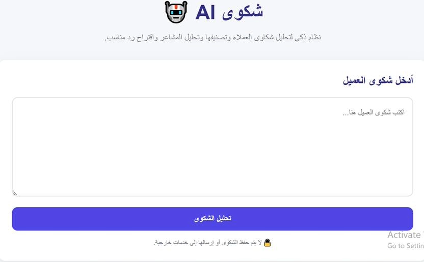

# شكوى AI

نظام ذكي لتحليل شكاوى العملاء لمساعدة موظفي خدمة العملاء على تصنيف الشكوى، وتحليل مشاعر العميل، واقتراح رد مناسب.  
يستخدم المشروع نموذج تعلم آلي لتصنيف النصوص، مع تحليل مشاعر مبني على كلمات مفتاحية، ويعمل مباشرة داخل المتصفح دون الحاجة إلى API خارجي.

## المشكلة

استقبال عدد كبير من شكاوى العملاء وفرزها يدويًا قد يستغرق وقتًا، كما قد يصعب اكتشاف نوع المشكلة ونبرة العميل بسرعة.

المستخدم المستهدف هو موظف خدمة العملاء أو الجهة التي تستقبل شكاوى وملاحظات العملاء.

## الحل وكيف يعمل الذكاء الاصطناعي فيه

يستخدم المشروع نموذج **Logistic Regression** تم تدريبه على بيانات تجريبية لشكاوى العملاء.

خطوات العمل:

1. تنظيف النص العربي.
2. تحويل النص إلى خصائص رقمية باستخدام **TF-IDF** مع character n-grams.
3. استخدام نموذج **Logistic Regression** لتصنيف الشكوى.
4. تحليل المشاعر إلى: إيجابي، سلبي، أو محايد.
5. اقتراح رد مناسب بناءً على تصنيف الشكوى.

### المدخلات والمخرجات

**المدخل:** نص شكوى العميل.

**المخرجات:** تصنيف الشكوى، المشاعر، والرد المقترح.

## رابط التجربة

[فتح مشروع شكوى AI مباشرة](https://wafasaad147-ops.github.io/Complaint_AI_Project/)

## طريقة التشغيل

- افتح رابط التجربة.
- اكتب شكوى العميل في مربع النص.
- اضغط **تحليل الشكوى**.
- ستظهر الفئة والمشاعر والرد المقترح.

> لا يحتاج المشروع إلى Gemini API أو أي مفتاح API، ولا يرسل الشكوى إلى خدمة خارجية.

## لقطات من المشروع

### واجهة المشروع

### نتيجة تحليل الشكوى

## حدود المشروع

- مجموعة التدريب صغيرة وتتكون من 20 مثالًا، لذلك التعميم محدود.
- تحليل المشاعر يعتمد على مجموعة من الكلمات المفتاحية وقد يخطئ مع العبارات المعقدة.
- النموذج مناسب كنموذج أولي تعليمي وليس كنظام إنتاج واسع النطاق.

## الخطوات القادمة

- زيادة حجم وتنوع بيانات التدريب.
- تحسين معالجة اللغة العربية.
- قياس دقة النموذج باستخدام بيانات اختبار مستقلة.
- إضافة لوحة إحصائيات وتحليلات للشكاوى.

## صاحب المشروع

**Wafa Saad , Somayah Saad**
